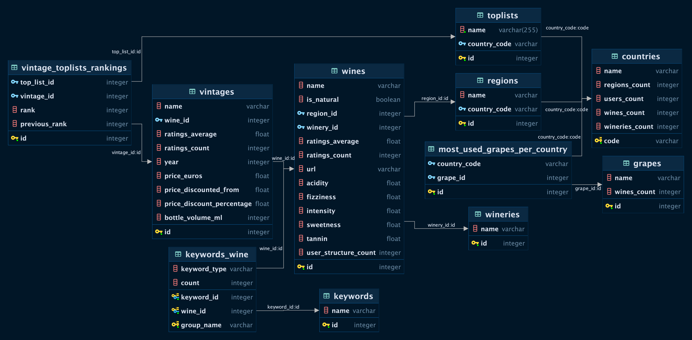

# Vivino market analysis

- Repository: `wine_market_analysis`
- Type of Challenge: `Learning`
- Duration: `1 week`
- Deadline: `17/11/2023 5:00 PM`
- Deployment strategy :
  - PowerPoint
  - Jupyter Notebook
  - SQL viewer / browser
- Team challenge : `solo`

## Mission objectives

Consolidate the knowledge in SQL, specifically in :

- JOIN operations
- GROUP BY operations
- AGGREGATIONS operations *(average, sums,...)*
- SELECT operations
- LIMIT operations
- ...

## Learning Objectives

- to be able to read and understand an SQL database diagram
- to be able to query an SQL database 
- to be able to create visuals from an SQL database
- to be able to write efficient SQL queries
- to be able to present a market analysis to a business client

## The Mission

> We are _Wiwinio_, active in the wine industry. We have been gathering data about wines from our users for years. The company wants have a better understanding of the wine's market. Create a report for us.

## The data

You can find the database in [Sqlite](https://www.sqlite.org/index.html) format [here](https://drive.google.com/file/d/122rj3-c0mpFPL04IXeXjSp2_H66-33RS/view?usp=sharing).

Here is the database diagram. The `yellow keys` symbol represents `PRIMARY KEYS` while the `blue keys` represents `FOREIGN KEYS`. Each column is typed. You can see the types are not exactly the same as the Python's types. You can find a [list of SQL types here](https://www.w3schools.com/sql/sql_datatypes.asp).

### Must-have features

A complete market analysis report that answers these questions:

- We want to highlight 10 wines to increase our sales. Which ones should we choose and why?
- We have a marketing budget for this year. Which country should we prioritise and why?
- We would like to give awards to the best wineries. Come up with 3 relevant ones. Which wineries should we choose and why? Be creative ;)
- We have detected that a big cluster of customers like a specific combination of tastes. We have identified a few `primary` `keywords` that match this. 
- We have detected that a big cluster of customers like a specific combination of tastes. We have identified a few `primary` `keywords` that match this. We would like you to **find all the wines that have those keywords**. To ensure the accuracy of our selection, ensure that **more than 10 users confirmed those keywords**. Also, identify the `group_name` related to those keywords.

**⚠️ Those keywords are CASE SENSITIVE ⚠️**

	- coffee
	- toast
	- green apple
	- cream
	- citrus

- We would like to select wines that are easy to find all over the world. **Find the top 3 most common `grape` all over the world** and **for each grape, give us the the 5 best rated wines**.
- We would to give create a country leaderboard, give us a visual that shows the **average wine rating for each `country`**. Do the same for the `vintages`.
- Give us any other useful insights you found in our data. **Be creative!**

### Nice-to-have features

- Optimise your solution to have the result as fast as possible.
- Implement visualizations best practices (e.g. data storytelling, nice design, relevancy to the questions asked, etc.). 
- One of our VIP client likes `Cabernet Sauvignon` and would like our top 5 recommendations. Which wines would you recommend to him?
- Can you recommend anything to improve the data, the database schema or the typing?

### Constraints

- You are not allowed to use pandas or similar tools.
- Write your requests in dedicated `.sql` files.
- Use SQL `JOIN` operations to cross-reference tables. You can not do it using Python.

## Deliverables

1. Publish your source code on a GitHub repository.
2. Pimp up the README file:
   - Description
   - Installation
   - Usage
   - (Visuals)
   - (Contributors)
3. Show us your results in a nice presentation.

### Steps

1. Create the repository
2. Study the instructions (What & Why ?)
3. Download the data
4. Identify technical challenges (How ?)
5. Start exploring the data
6. Create a report with your findings
7. Clear your code and document it

## Evaluation criteria

| Criteria       | Indicator                                              | Yes/No |
| -------------- | ------------------------------------------------------ | ------ |
| 1. Is complete | You have an answer for each question                   |        |
|                | You push your changes to GitHub at least once a day    |        |
|                | There is a visualization available when it makes sense |        |
| 2. Is great    | You SQL queries are optimized                          |        |
|                | Your code is commented/typed                           |        |
|                | You report is clear and well designed                  |        |

## A final note of encouragement

